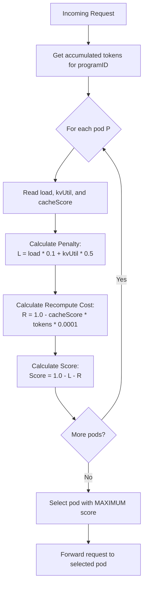
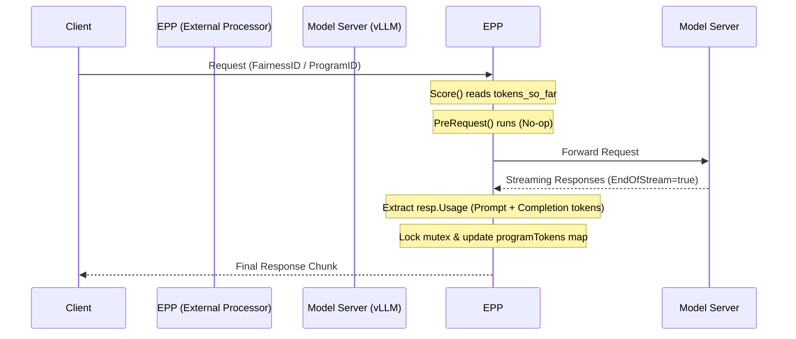

# Program-Aware Cost-Based Load Balancing Scorer - Design Document

## Overview

The **Program-Aware Cost-Based Scorer** is a custom scheduling plugin for the LLM-D inference scheduler designed to minimize end-to-end request latency for multi-turn conversational agents (programs). 

Unlike traditional budget-based or static-affinity schedulers, this scorer dynamically balances **queuing time** on loaded pods against **recomputation time** on clean pods. It makes routing decisions on a per-request basis using the historical context footprint (accumulated tokens) of each program.

---

## Core Concepts

### 1. The Cost Trade-off
LLM inference involves two primary phases: prefill (context processing) and generation.
- **Staying on a Cache-Hit Pod**: Reuses the KV cache from previous requests, avoiding prefill latency. However, if the pod is busy, the request must wait in the scheduler queue.
- **Migrating to a Cache-Miss Pod**: Bypasses the queue, but requires the GPU to process the entire history from scratch (prefill cold start).

Our scorer evaluates the estimated time cost of both options and chooses the path that minimizes total latency.

### 2. Unified Scoring Model
For every candidate pod $P$, we calculate a score:
$$\text{Score}(P) = 1.0 - L(P) - R(P)$$

Where:
- $L(P)$ is the **Load and Utilization Penalty** on pod $P$.
- $R(P)$ is the **KV Cache Recomputation Cost** incurred if routed to pod $P$.

---

## Scoring Formulas

### 1. Load and Utilization Penalty ($L(P)$)
The penalty penalizes pods with high queuing delays or high GPU memory pressure:
$$L(P) = \alpha \times \text{load}_{P} + \beta \times \text{kvUtil}_{P}$$

- $\text{load}_{P}$: `WaitingQueueSize` (requests in queue).
- $\text{kvUtil}_{P}$: `KVCacheUsagePercent` (GPU cache usage, range: `[0.0, 1.0]`).
- $\alpha$: `loadCoefficient` (default: `0.1`, represents penalty per queued request).
- $\beta$: `kvCoefficient` (default: `0.5`, represents penalty for full memory).

### 2. KV Cache Recomputation Cost ($R(P)$)
The recomputation cost represents the time required to rebuild the missing fraction of the program's KV cache:
$$R(P) = (1.0 - \text{cacheScore}_{P}) \times \text{tokens\_so\_far} \times \gamma$$

- $\text{cacheScore}_{P}$: Cache hit ratio (matchBlocks / totalBlocks, range: `[0.0, 1.0]`).
- $\text{tokens\_so\_far}$: Cumulative prompt + completion tokens processed so far for the program ID.
- $\gamma$: `recomputeCoefficient` (default: `0.0001`, converts tokens to equivalent load penalty).

---

## Logical Flow



### Dynamic Routing Behaviors

1. **Cache Miss Case**:
   If all pods are cache misses (`cacheScore = 0`), they all pay the same recomputation cost $R(P) = \text{tokens\_so\_far} \times \gamma$. The scores are determined entirely by the load penalty $L(P)$. The request is routed to the pod with the **lowest load and KV utilization**.

2. **Small Program Cache (Migration Path)**:
   If a program has a small context footprint (e.g. $500$ tokens), the recompute cost is negligible ($0.05$). If the cache-hit pod has even a small queue (e.g., $1$ request), the load penalty ($0.1$) is larger than the recomputation cost. The scorer **migrates** the request to an idle pod, where it executes immediately with a fast prefill.

3. **Large Program Cache (Stay/Wait Path)**:
   If a program has a huge context footprint (e.g. $10,000$ tokens), the recompute cost on a clean pod is very high ($1.0$). The scorer will choose to **stay and queue** on the cache-hit pod even if it has a moderate queue (e.g. $5$ requests), because waiting in the queue is faster than re-processing $10,000$ tokens on a clean GPU.

4. **Saturated Hotspot Prevention**:
   If a cache-hit pod becomes extremely overloaded (e.g. queue size $\ge 12$), its load penalty ($L(P) \ge 1.2$) will eventually exceed the recomputation cost ($R(P) \le 1.0$) of even a massive program. The scorer will **force a migration** to an idle pod to prevent the queue from growing indefinitely.

---

## Token Tracking Lifecycle

We track the context footprint in-memory using a thread-safe map protected by a read-write mutex:



---

## Configuration parameters

The plugin parameters can be configured in the `EndpointPickerConfig` YAML file:

```yaml
- type: program-aware-scorer
  name: program-aware-scorer
  parameters:
    prefixMatchInfoProducerName: precise-prefix-cache-producer
    loadCoefficient: 0.1          # Penalty weight per queued request (alpha)
    kvCoefficient: 0.5            # Penalty weight for 100% KV cache usage (beta)
    recomputeCoefficient: 0.0001 # Prefill delay penalty per historical token (gamma)
    queueThreshold: 100           # Queuing normalization threshold
```

### Default Parameters
- `loadCoefficient`: `0.1`
- `kvCoefficient`: `0.5`
- `recomputeCoefficient`: `0.0001`
- `queueThreshold`: `100.0`
